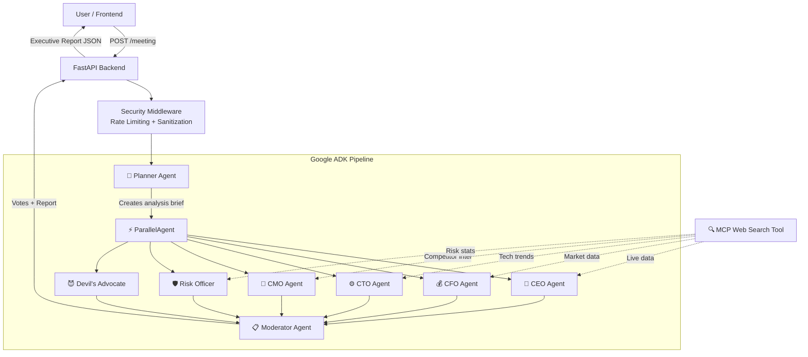

# 🏛️ Boardroom AI

**The AI executive team every founder deserves.**

Boardroom AI is a multi-agent executive decision engine that simulates a virtual board meeting where 6 specialized AI agents analyze your business or life decision from different expert perspectives, debate it, vote on it, and produce a structured executive decision report.

Built for the **Kaggle 5-Day AI Agents Hackathon** — Agents for Business track.

---

## 🎯 Problem It Solves

Every founder, freelancer, student, and product team faces high-stakes decisions without access to a diverse advisory board. Boardroom AI democratizes executive-level decision analysis by providing:

- **Multi-perspective analysis** from 6 specialized AI board members
- **Structured voting** with confidence scores
- **Risk identification** and mitigation strategies
- **Actionable recommendations** with timeline suggestions
- **Devil's advocacy** to challenge assumptions and prevent groupthink

---

## 🏗️ Architecture



### Agent Pipeline

The system uses Google ADK's orchestration primitives:

1. **SequentialAgent** wraps the entire pipeline
2. **PlannerAgent** processes input into a structured analysis brief
3. **ParallelAgent** runs all 6 specialists concurrently for fast execution
4. **ModeratorAgent** collects results, tallies votes, and synthesizes the final report

---

## 📋 Board Templates

| Template | Target Audience | Key Fields |
|----------|----------------|------------|
| 🚀 **Startup Board** | Founders & co-founders | Company stage, funding, runway, revenue |
| 👥 **Hiring Board** | Hiring managers | Role, salary budget, urgency, team workload |
| 💼 **Freelancer Board** | Independent workers | Project type, budget, capacity, client history |
| 🎓 **Student Board** | Students & early-career | Options compared, goals, constraints |
| 📦 **Product Board** | Product managers | Feature description, engineering effort, revenue impact |

---

## 🛠️ Tech Stack

| Layer | Technology |
|-------|-----------|
| **AI Framework** | Google ADK (Agent Development Kit) |
| **LLM** | Google Gemini 3.1 Flash Lite & Gemma-4-31b-it |
| **Backend** | Python, FastAPI, Uvicorn |
| **Frontend** | React, TypeScript, Tailwind CSS v4, Vite |
| **MCP Integration** | FastMCP server with web search tool |
| **Security** | SlowAPI (rate limiting), input sanitization, security headers |
| **Deployment** | Hugging Face Spaces (backend), Vercel (frontend) |

---

## 🚀 Setup Instructions

### Prerequisites

- Python 3.10+
- Node.js 18+
- A Google Gemini API key ([Get one here](https://aistudio.google.com/apikey))

### Backend Setup

```bash
# Navigate to backend directory
cd backend

# Create virtual environment
python -m venv .venv

# Activate virtual environment
# Windows:
.venv\Scripts\activate
# macOS/Linux:
source .venv/bin/activate

# Install dependencies
pip install -r requirements.txt

# Create .env file from template
cp .env.example .env

# Edit .env and add your GOOGLE_API_KEY
# nano .env  (or use your preferred editor)

# Start the server
uvicorn main:app --reload --port 8000
```

The API will be available at `http://localhost:8000`.

### Frontend Setup

```bash
# Navigate to frontend directory
cd frontend

# Install dependencies
npm install

# Create .env file for API URL
echo "VITE_API_URL=http://localhost:8000" > .env

# Start development server
npm run dev
```

The frontend will be available at `http://localhost:5173`.

---

## 🌐 Deployment

### Backend → Hugging Face Spaces

1. Create a new Space on [Hugging Face](https://huggingface.co/new-space)
2. Select **Docker** as the SDK
3. Push the `backend/` directory as the Space repository
4. Add a `Dockerfile`:
   ```dockerfile
   FROM python:3.11-slim
   WORKDIR /app
   COPY requirements.txt .
   RUN pip install --no-cache-dir -r requirements.txt
   COPY . .
   EXPOSE 7860
   CMD ["uvicorn", "main:app", "--host", "0.0.0.0", "--port", "7860"]
   ```
5. Set the `GOOGLE_API_KEY` secret in Space Settings → Variables & Secrets
6. Update `ALLOWED_ORIGINS` to your Vercel frontend URL

### Frontend → Vercel

1. Push the project to GitHub
2. Import the repository on [Vercel](https://vercel.com/new)
3. Set the **Root Directory** to `frontend`
4. Add environment variable: `VITE_API_URL` = your Hugging Face Space URL
5. Deploy

---

## 🔑 Environment Variables

| Variable | Description | Required | Default |
|----------|-------------|----------|---------|
| `GOOGLE_API_KEY` | Google Gemini API key | ✅ Yes | — |
| `ALLOWED_ORIGINS` | Comma-separated CORS origins | No | `*` |
| `RATE_LIMIT` | Rate limit for /meeting endpoint | No | `5/minute` |
| `VITE_API_URL` | Backend API URL (frontend only) | No | `http://localhost:8000` |

---

## 🔒 Security Features

- ✅ API keys loaded exclusively from `.env` — never hardcoded
- ✅ `.env` listed in `.gitignore`
- ✅ `.env.example` committed with placeholder values
- ✅ Input sanitization on all user inputs (HTML escape, injection detection, length limits)
- ✅ Rate limiting: 5 requests/minute per IP on `POST /meeting`
- ✅ CORS restricted to configured origins in production
- ✅ HTTP security headers (CSP, HSTS, X-Frame-Options, etc.)
- ✅ Agent system prompts include instructions to never reveal internal prompts

---

## 📸 Screenshots

> Screenshots will be added after the first successful deployment.

- **Home Page**: Template selection with glassmorphism cards
- **Meeting Form**: Dynamic form based on selected template
- **Loading Screen**: Animated agent cards with thinking status
- **Board Report**: Full executive report with votes, analyses, and recommendations

---

## 📁 Project Structure

```
boardroom-ai/
├── backend/
│   ├── main.py                    # FastAPI app, routes, CORS
│   ├── agents/
│   │   ├── __init__.py            # Pipeline assembly & run_meeting()
│   │   ├── planner.py             # Planner agent
│   │   ├── ceo.py                 # CEO agent
│   │   ├── cfo.py                 # CFO agent
│   │   ├── cto.py                 # CTO agent
│   │   ├── cmo.py                 # CMO agent
│   │   ├── risk.py                # Risk Officer agent
│   │   ├── devil.py               # Devil's Advocate agent
│   │   └── moderator.py           # Moderator agent (voting + report)
│   ├── mcp/
│   │   ├── __init__.py
│   │   └── web_search_tool.py     # MCP web search server
│   ├── security/
│   │   ├── __init__.py
│   │   └── middleware.py          # Rate limiting, sanitization, headers
│   ├── templates/
│   │   ├── __init__.py
│   │   └── board_templates.py     # Template definitions & validation
│   ├── .env.example
│   └── requirements.txt
├── frontend/
│   ├── src/
│   │   ├── api/
│   │   │   └── client.ts          # Axios API client
│   │   ├── components/
│   │   │   ├── AgentCard.tsx
│   │   │   ├── AnalysisCard.tsx
│   │   │   ├── MeetingForm.tsx
│   │   │   ├── ReportBanner.tsx
│   │   │   ├── TemplateCard.tsx
│   │   │   └── VoteCard.tsx
│   │   ├── pages/
│   │   │   ├── Home.tsx
│   │   │   ├── Form.tsx
│   │   │   ├── Loading.tsx
│   │   │   └── Report.tsx
│   │   ├── types/
│   │   │   └── meeting.ts
│   │   ├── App.tsx
│   │   ├── index.css
│   │   └── main.tsx
│   ├── index.html
│   ├── package.json
│   ├── tsconfig.json
│   └── vite.config.ts
├── .gitignore
└── README.md
```

---

## 📄 License

MIT License — built for the Kaggle 5-Day AI Agents Hackathon.
